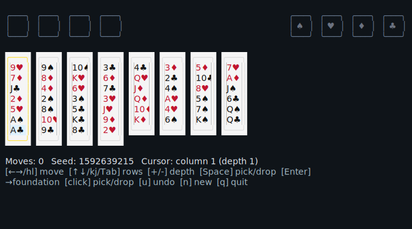

# freecell

A terminal FreeCell solitaire built with [OpenTUI](https://opentui.com).



## Run

```
bun install
bun start
```

Requires Bun (the OpenTUI core uses a native Zig library loaded via FFI; Node is not supported).

## Controls

| Key | Action |
| --- | --- |
| `←` `→` / `h` `l` | Move cursor between piles |
| `↑` `↓` / `k` `j` / `Tab` | Hop between the top row (free cells & foundations) and the tableau |
| `1`–`8` | Jump cursor to tableau column 1–8 |
| `+` / `-` (also `]` / `[`) | Increase / decrease how many cards to pick up from a tableau column |
| `Space` | Pick up the highlighted card(s); press again on a target to drop |
| `Enter` | Auto-send the top card under the cursor to its foundation |
| `u` | Undo |
| `n` | New game |
| `q` / `Ctrl-C` | Quit |

## Rules recap

- Build the four **foundations** up by suit, A → 2 → 3 → ... → K.
- The eight **tableau** columns build down in **alternating colours** (e.g. red 7 on a black 8).
- Each **free cell** holds one card.
- The pickup-size cap on a tableau-to-tableau move is `(empty free cells + 1) × 2^(empty tableau columns)` (the classic FreeCell "supermove").
- After every move, any card that is safe to send (rank ≤ the smallest unplayed opposite-colour rank + 1) is moved to its foundation automatically.
